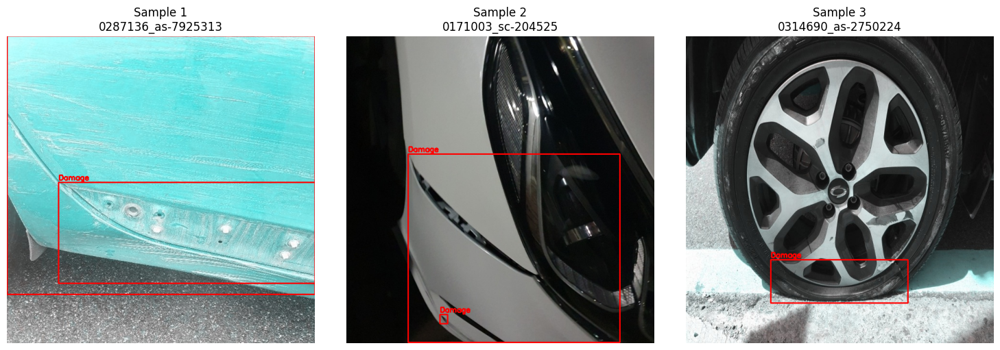

# 🚀 차량 파손 탐지((Car Damage Detection)
차량 이미지에서 파손 여부 및 파손 부위를 탐지하는 AI 모델 개발. 기존에 학습된 **차량 탐지 모델(Study 1)** 을 전처리기(Preprocessor)로 활용하여, 차량 영역을 크롭(Crop)한 뒤 파손을 탐지하는 2-Stage Pipeline을 구축

## 🎯 Objective (실험 목표)
1. **Goal** : 차량 이미지에서 파손된 부위(Damage)를 정확하게 탐지하고, 정상 차량과 파손 차량을 분류.
2. **Model** : YOLOv8 (Ultralytics)
3. **Strategy** :
   - Stage 1 (Preprocessing): 1차 모델을 이용해 차량 위치(BBox) 식별 및 Crop
   - Stage 2 (Detection): Crop된 차량 이미지 내에서 파손 부위 탐지.
4. **Data Strategy** :
   - Positive Sample (Damaged)과 Negative Sample (Normal)을 모두 활용하여 오탐(False Positive) 방지 학습
   - 파손 클래스 통합 (Scratched, Dented 등 -> Damage 단일 클래스)
     
## Experiment Setup (학습 환경)
* **Model:** YOLOv8 
* **Environment:** Google Colab Pro (A100 / T4 GPU)

## 🛠 Workflow

1. Data Preparation
  - Source: AI Hub + coco data
  - Input Structure:
    - Damaged: 파손 차량 이미지 + JSON 라벨 (Global Coordinates)
    - Normal: 정상 차량 이미지 (No Labels)

2. Preprocessing (Coordinate Remapping)
  - 1단계 차량 탐지 모델(yolov8m_fine_tuning_3rd.pt)을 활용하여 학습 데이터를 생성
    1) Vehicle Detection: 원본 이미지에서 차량의 Bounding Box를 검출
    2) Crop with Margin: **파손 부위 소실을 방지하기 위해 BBox에 15% Margin을 적용** 하여 이미지 Crop
    3) Coordinate Remapping:
      - 원본 JSON의 파손 좌표(Global)를 Crop 이미지 기준(Local)으로 변환.
      - Crop 영역을 벗어나는 좌표에 대해 **Clamp(보정)** 로직 적용.
    4) Dataset Split: Train (70%) : Val (20%) : Test (10%) 무작위 분할.

| **dataset samples** | 
| :---: |
|  |

3. Model Training
  - Base Model: yolov8x.pt / yolov8m.pt (Fine-tuning)
  - Configuration:
  - Epochs: 50~100
  - Image Size: 640 ~ 1024
  - Optimizer: AdamW
  - Augmentation: Mosaic (마지막 Epoch에서 비활성화)
  
| class | count | ratio | 
| :---: | :---: | :---: | 
| Train | 949 | 0.7 |
| Valid | 272 | 0.2 | 
| Test | 136 | 0.1 |  
| total | 1357 | 1.0 | 

## 📊 Performance Evaluation (test set)

### 1. Metrics Comparison (베이스라인 vs 파인튜닝 1st vs 파인튜닝 2nd vs vs 파인튜닝 3rd)

| Class | Model | Accuracy | average inference speed | FPS | GPU | test | fail |비고 |
| :---: | :---: | :---: | :---: | :---: |:---: | :---: |:---: |:---: |
| **Baseline (pre-trained)** |yolo v8x|88.71%| 48.23 ms/장 | 20.73 FPS |T4|1957 | 221 |no-tuning |
| **Fine-tuned. ver1.0** | yolo v8x|88.27%| 20.60 ms/장 | 48.55 FPS |L4|196 | 23 | freeze10 + epoch 50 |
| **Fine-tuned. ver2.0** | yolo v8x|97.45%| 20.12 ms/장 | 49.70 FPS |L4|196 | 5 | ver1.0 + hybrid labeling |
| **Fine-tuned. ver3.0** | yolo v8m|98.47%| 22.98 ms/장 | 43.51 FPS |L4|196 | 3 | ver1.0 + hybrid labeling + IMG_SIZE 1024 + BATCH_SIZE 8 + close_mosaic 15|

### 💡 Findings
* fine-tuning을 통해 Accuracy는 비약적으로 상승(88.71% > 98.47%)하였고, 특히 FN는 줄고, TP가 상승하였다.

| **Baseline (pre-trained)** | **Fine-tuned. ver1.0** | **Fine-tuned. ver2.0** | **Fine-tuned. ver3.0** |
| :---: | :---: | :---: | :---: |
|  |  |  |  |

| Model | Class | Precision | Recall | f1 | 
| :---: | :---: | :---: | :---: | :--- | 
| **Baseline (pre-trained)** |Non-Vehicle| 0.74 | 0.96 | 0.84 |  
| **Baseline (pre-trained)** |Vehicle| 0.98 | 0.85 | 0.91 | 
| **Fine-tuned. ver1.0** |Non-Vehicle| 0.73 | 0.98 | 0.84 |  
| **Fine-tuned. ver1.0** |Vehicle| 0.99 | 0.84 | 0.91 | 
| **Fine-tuned. ver2.0** |Non-Vehicle| 0.97 | 0.95 | 0.96 |
| **Fine-tuned. ver2.0** |Vehicle| 0.98 | 0.99 | 0.98 | 
| **Fine-tuned. ver3.0** |Non-Vehicle| 0.98 | 0.97 | 0.97 |
| **Fine-tuned. ver3.0** |Vehicle| 0.99 | 0.99 | 0.99 | 

| **model results** | 
| :---: | 
|  | 

| **valid sample** | 
| :---: | 
|  | 

## 원인 추정(1st 문제점 해결 여부)
- fine-tuning 1st 모델의 성능이 향상하지 못 했던 원인은 **학습 데이터 간의 "정답 기준"이 서로 다르기 때문**일 가능성으로 추정
- 이미지 시각화 결과, labeling 문제를 하이브리드 전략으로 개선한 것으로 확인
    - GT : 차량 파손 부위 일부를 라벨링
    - predicted : 차량 전체 향상을 라벨링

## 🛠 오탐 대상 
 - damaged images(2) 중 이미지가 뒤집혔거나, 파손 부위가 확대된 차량 이미지를 인식하지 못함

| **false samples** | 
| :---: |
|  |

## fine-tuning 3rd
   1) 해상도 증가하여 미세한 부위 명확히 구분
   2) 모델 경량화하여 리소스 효율성 확보 및 과적합 방지
   3) **Mosaic 증강** 종료 시점 설정
      - Mosaic 증강이란? 4장의 이미지를 랜덤하게 잘라 붙여서 1장으로 만드는 기법. 이는 모델이 다양한 스케일과 배경을 학습하게 하여 일반화 성능을 높여줌.
      - 왜 끄나요? Mosaic 이미지는 인위적으로 합성된 이미지라 실제 자연스러운 이미지와는 다름. 학습 초기에는 좋지만, 후반부에는 **실제 원본 이미지**의 분포를 익혀야 파손 부위의 정확한 좌표를 잡을 수 있음
      - 효과: 마지막 15 Epoch 동안은 원본 형태의 이미지만 보게 하여, BBox(박스) 위치를 미세 조정하고 오탐을 줄여 성능을 안정화
        
| **false samples** | 
| :---: |
|  |
   
 

## 📝 Conclusion 
* **결론:** 하이브리드 라벨링을 전략을 활용한 Fine-tuning을 통해 모델의 정확도를 비약적으로 상승시킴(98.47%)
