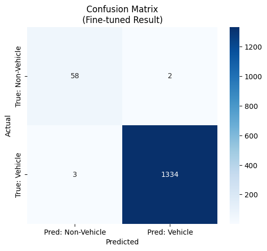
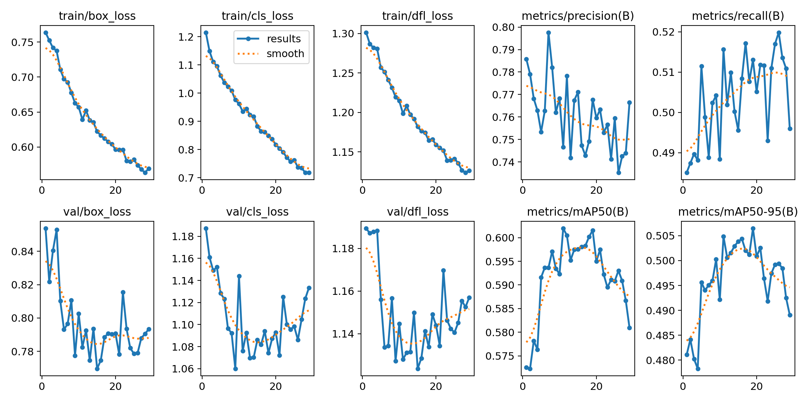
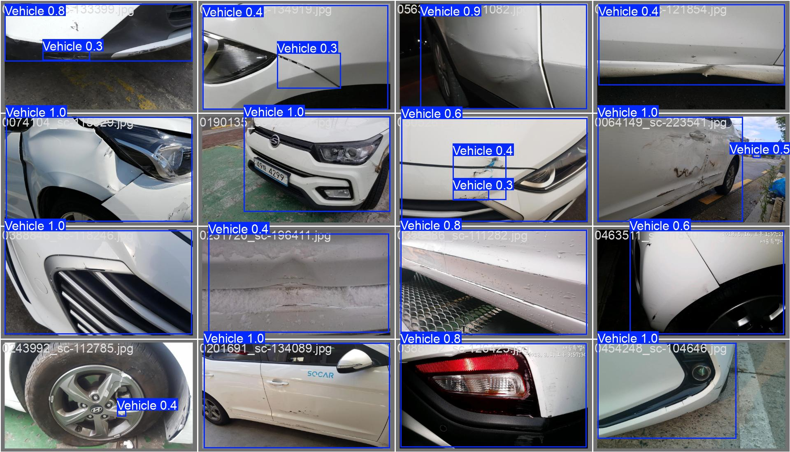
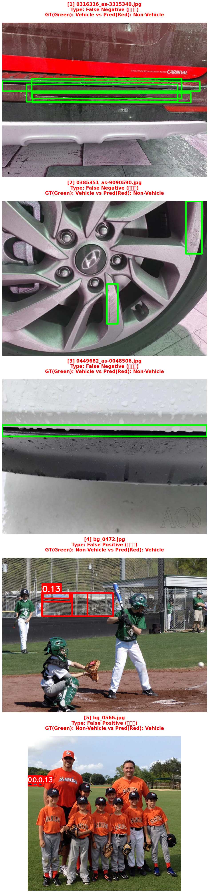

# 🚀 Step 5. YOLOv8x Fine-tuning (4th Attempt)

* 베이스라인(Pre-trained) 성능을 넘어서기 위해, 커스텀 데이터셋(AI-Hub 파손 차량 + COCO)을 **YOLOv8x 모델을 이용해 Fine-tuning** 실행  
* (3rd)기존 normal 데이터의 부족으로 인한 클래스 불균형을 **kaggle 데이터** 로 보충
* (4th)기존 damaged 데이터를 AI-HUB 샘플 1,200장이 아닌 전체 데이터(50만장)에서 파손 유형 클래스별로 동일한 비율로 **총 12,000장 추출**

| Class (Category) | Source | Images | Labels | Note |
| :--- | :--- | :--- | :--- | :--- |
| **1. Damaged** | AI-Hub | **12,000** | 12,000 | 차량 파손 이미지 (Training Target) |
| **2. Normal** | COCO 2017+kaggle | **938** | - | 정상 차량 (면적 5% 이상 필터링 적용됨) + kaggle normal data |
| **3. Background** | COCO 2017 | **611** | - | 차량 없음 (Negative Samples) |
| **Total** | | **13,549** | | **✅ 구축 완료** |

## 🎯 Objective (실험 목표)
1.  **Domain Adaptation:** 일반적인 COCO 데이터셋뿐만 아니라, **심하게 파손된 차량(Damaged Car)** 데이터 분포에 모델을 적응시킴
2.  **Performance Boost:** 베이스라인 대비 **mAP(평균 정밀도)** 와 **Recall(재현율)** 을 얼마나 향상시킬 수 있는지 확인
3.  **Optimization:** 우리 데이터셋에 맞는 최적의 하이퍼파라미터(Epochs, Batch size 등)를 탐색

## 🛠 Experiment Setup (학습 환경)
* **Model:** YOLOv8x (Load weights from `yolov8x.pt`)
* **Environment:** Google Colab Pro (L4)

## Dataset
1. 데이터셋 구축 및 표준화 (Dataset Construction & Standardization)
 - **하이브리드 라벨링 전략** (Hybrid Labeling Strategy)
    - 1단계 (우선순위): Auto-Labeling (YOLOv8x)
        - 일단 Pre-trained 모델로 "차량 전체 형상"을 찾기
        - 성공 시: Normal 데이터와 기준이 같아지므로 베스트
    - 2단계 (Fallback): JSON 라벨 활용
        - 만약 모델이 너무 확대된(Zoom-in) 이미지라 차량을 못 찾으면(Empty), 그때 JSON의 파손 부위 좌표를 가져옴
    - 이유: 1단계에서 탐지 못 해도, 빈 파일(Background)로 두는 게 아니라 **Damaged의 labeling**을 활용해 파손 부분만이라도 '차량'으로 학습

2. 데이터 분할 및 격리
 - 모델의 암기(Memorizing)를 방지하고 객관적인 성능 검증을 위한 데이터 분리.
 - 비율 (Ratio): 전체 데이터를 랜덤으로 섞은  7 : 2 : 1 비율로 랜덤 분할.
    - Train (70%): 모델 가중치 업데이트용 (학습).
    - Val (20%): 학습 중 성능 모니터링 및 조기 종료(Early Stopping) 결정용.
    - Test (10%): 학습 과정에 절대 관여하지 않으며, 최종 성능 평가에만 사용
  
| class | count | ratio |backgroud | 
| :---: | :---: | :---: | :---: | 
| Train | 9,543 | 0.7 |441|
| Valid | 2,690 | 0.2 |111| 
| Test | 1,316 | 0.1 |59|  
| total | 13,549 | 1.0 | 611(4.5%)|

### ⚙️ Hyperparameters
| Parameter | Value | Note |
| :--- | :--- | :--- |
| **Epochs** | 50 | 조기 종료(Early Stopping) 적용 여부 확인 필요 |
| **Batch Size** | 16 | GPU 메모리에 맞춰 조정 |
| **Img Size** | 640 | YOLOv8 기본 입력 크기 |
| **freeze** | 10 | pre-trained 모델의 back-bone 유지 |
| **Lr0** | 1e-4 | Initial Learning Rate.초기학습률. 이미 학습이 잘 된 모델이니 조금씩 수 |
| **Optimizer** | SGD / AdamW |학습 속도가 빠르고 설정에 덜 민감(Yolov8 기본) |
| **patience** | 10 |early-stopping 조절. 성능이 더 이상 좋아지지 않을때, epoch반복 |

## 📊 Training Results (학습 결과)
학습 완료 후 `model.val()`을 통해 얻은 최종 성능 지표입니다.

### 1. Metrics Comparison (베이스라인 vs 파인튜닝 1st vs 파인튜닝 2nd vs vs 파인튜닝 3rd)

| Class | Model | Accuracy | average inference speed | FPS | GPU | test | fail |비고 |
| :---: | :---: | :---: | :---: | :---: |:---: | :---: |:---: |:---: |
| **Baseline (pre-trained)** |yolo v8x|88.71%| 48.23 ms/장 | 20.73 FPS |T4|1957 | 221 |no-tuning |
| **Fine-tuned. ver1.0** | yolo v8x|88.27%| 20.60 ms/장 | 48.55 FPS |L4|196 | 23 | freeze10 + epoch 50 |
| **Fine-tuned. ver2.0** | yolo v8x|97.45%| 20.12 ms/장 | 49.70 FPS |L4|196 | 5 | ver1.0 + hybrid labeling |
| **Fine-tuned. ver3.0** | yolo v8m|98.47%| 22.98 ms/장 | 43.51 FPS |L4|196 | 3 | ver1.0 + hybrid labeling + IMG_SIZE 1024 + BATCH_SIZE 8 + close_mosaic 15|
| **Fine-tuned. ver4.0** | yolo v8x|97.57%| 14.35 ms/장 | 69.69 FPS |L4|288 | 7 | ver1.0 + hybrid labeling + IMG_SIZE 640 + BATCH_SIZE 16 + close_mosaic 0 + kaggle dataset|
| **Fine-tuned. ver5.0** | yolo v8x|99.09%| 15.25 ms/장 | 65.59 FPS |L4|1316 | 12 | ver1.0 + hybrid labeling + IMG_SIZE 640 + BATCH_SIZE 16 + close_mosaic 10 + kaggle dataset + AI-HUB 12000(conf=0.10)|

### 💡 Findings
* fine-tuning을 통해 Accuracy는 비약적으로 상승(88.71% > 98.47%)하였고, 특히 FN는 줄고, TP가 상승하였다.
* (추가) normal 데이터셋을 추가하여 아주 소폭 accuracy 하락

| **Baseline (pre-trained)** | **Fine-tuned. ver1.0** | **Fine-tuned. ver2.0** | **Fine-tuned. ver3.0** | **Fine-tuned. ver4.0** |**Fine-tuned. ver5.0** |
| :---: | :---: | :---: | :---: | :---: | :---: |
|  |  |  |  |  |  |

| Model | Class | Precision | Recall | f1 | 
| :---: | :---: | :---: | :---: | :--- | 
| **Baseline (pre-trained)** |Non-Vehicle| 0.74 | 0.96 | 0.84 |  
| **Baseline (pre-trained)** |Vehicle| 0.98 | 0.85 | 0.91 | 
| **Fine-tuned. ver1.0** |Non-Vehicle| 0.73 | 0.98 | 0.84 |  
| **Fine-tuned. ver1.0** |Vehicle| 0.99 | 0.84 | 0.91 | 
| **Fine-tuned. ver2.0** |Non-Vehicle| 0.97 | 0.95 | 0.96 |
| **Fine-tuned. ver2.0** |Vehicle| 0.98 | 0.99 | 0.98 | 
| **Fine-tuned. ver3.0** |Non-Vehicle| 0.98 | 0.97 | 0.97 |
| **Fine-tuned. ver3.0** |Vehicle| 0.99 | 0.99 | 0.99 | 
| **Fine-tuned. ver4.0** |Non-Vehicle| 0.94 | 0.95 | 0.94 |
| **Fine-tuned. ver4.0** |Vehicle| 0.99 | 0.98 | 0.98 | 
| **Fine-tuned. ver5.0** |Non-Vehicle| 0.86 | 0.95 | 0.90 |
| **Fine-tuned. ver5.0** |Vehicle| 1.00 | 0.99 | 0.99 | 

| **model results** | 
| :---: | 
|  | 

| **valid sample** | 
| :---: | 
|  | 

## 원인 추정(1st 문제점 해결 여부)
- fine-tuning 1st 모델의 성능이 향상하지 못 했던 원인은 **학습 데이터 간의 "정답 기준"이 서로 다르기 때문**일 가능성으로 추정
- 이미지 시각화 결과, labeling 문제를 하이브리드 전략으로 개선한 것으로 확인
    - GT : 차량 파손 부위 일부를 라벨링
    - predicted : 차량 전체 향상을 라벨링

## fine-tuning 3rd
   1) 해상도 증가하여 미세한 부위 명확히 구분
   2) 모델 경량화하여 리소스 효율성 확보 및 과적합 방지
   3) **Mosaic 증강** 종료 시점 설정
      - Mosaic 증강이란? 4장의 이미지를 랜덤하게 잘라 붙여서 1장으로 만드는 기법. 이는 모델이 다양한 스케일과 배경을 학습하게 하여 일반화 성능을 높여줌.
      - 왜 끄나요? Mosaic 이미지는 인위적으로 합성된 이미지라 실제 자연스러운 이미지와는 다름. 학습 초기에는 좋지만, 후반부에는 **실제 원본 이미지**의 분포를 익혀야 파손 부위의 정확한 좌표를 잡을 수 있음
      - 효과: 마지막 15 Epoch 동안은 원본 형태의 이미지만 보게 하여, BBox(박스) 위치를 미세 조정하고 오탐을 줄여 성능을 안정화

## fine-tuning 4th
  - kaggle 데이터셋 추가
  - 오탐 7개 : FN(4) + FP(3)

## fine-tuning 5th
  - kaggle 데이터셋 추가
  - 오탐 12개 : FN(9) + FP(3)
   
| **false samples** | 
| :---: |
|  |
   

## 📝 Conclusion 
* **결론:** 하이브리드 라벨링을 전략과 kaggle의 데이터셋을 추가하여여 모델의 정확도를 비약적으로 상승시킴
