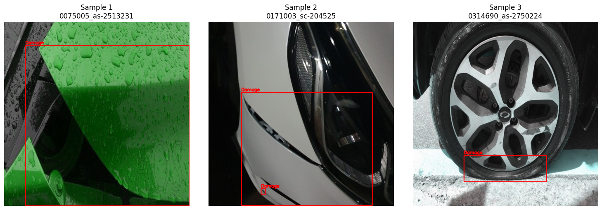
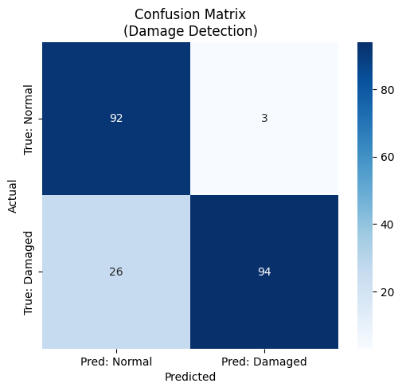
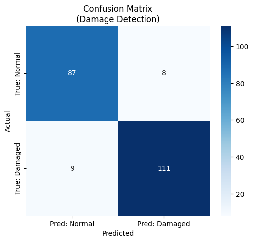

# 🚀 차량 파손 탐지((Car Damage Detection)
* 차량 이미지에서 파손 여부 및 파손 부위를 탐지하는 AI 모델 개발. 기존에 학습된 **차량 탐지 모델(Study 1)** 을 전처리기(Preprocessor)로 활용하여, 차량 영역을 크롭(Crop)한 뒤 파손을 탐지하는 2-Stage Pipeline을 구축
* kaggle normal 데이터를 추가하여 class 불균형 완화화

## 🎯 Objective (실험 목표)
1. **Goal** : 차량 이미지에서 파손된 부위(Damage)를 정확하게 탐지하고, 정상 차량과 파손 차량을 분류.
2. **Model** : YOLOv8 (Ultralytics)
3. **Strategy** :
   - Stage 1 (Preprocessing): 1차 모델을 이용해 차량 위치(BBox) 식별 및 Crop
   - Stage 2 (Detection): Crop된 차량 이미지 내에서 파손 부위 탐지.
4. **Data Strategy** :
   - Positive Sample (Damaged)과 Negative Sample (Normal)을 모두 활용하여 오탐(False Positive) 방지 학습
   - 파손 클래스 통합 (Scratched, Dented 등 -> Damage 단일 클래스)
     
## Experiment Setup (학습 환경)
* **Model:** YOLOv8 
* **Environment:** Google Colab Pro (T4 GPU)

## 🛠 Workflow

1. Data Preparation
  - Source: AI Hub + coco data
  - Input Structure:
    - Damaged: 파손 차량 이미지 + JSON 라벨 (Global Coordinates)
    - Normal: 정상 차량 이미지 (No Labels)

2. Preprocessing (Coordinate Remapping)
  - 1단계 차량 탐지 모델(yolov8m_fine_tuning_3rd.pt)을 활용하여 학습 데이터를 생성
    1) Vehicle Detection: 원본 이미지에서 차량의 Bounding Box를 검출
    2) Crop with Margin: **파손 부위 소실을 방지하기 위해 BBox에 15% Margin을 적용** 하여 이미지 Crop
    3) Coordinate Remapping:
      - 원본 JSON의 파손 좌표(Global)를 Crop 이미지 기준(Local)으로 변환.
      - Crop 영역을 벗어나는 좌표에 대해 **Clamp(보정)** 로직 적용.
    4) Dataset Split: Train (70%) : Val (20%) : Test (10%) 무작위 분할.

| **dataset samples** | 
| :---: |
|  |

3. Model Training
  - Base Model: yolov8x.pt / yolov8m.pt (Fine-tuning)
  - Configuration:
  - Epochs: 50~100
  - Image Size: 640 ~ 1024
  - Optimizer: AdamW
  - Augmentation: Mosaic (마지막 Epoch에서 비활성화)
  
| class | count | ratio | 
| :---: | :---: | :---: | 
| Train | 1,504 | 0.7 |
| Valid | 430 | 0.2 | 
| Test | 215 | 0.1 |  
| total | 2,149 | 1.0 | 

## 📊 Performance Evaluation (test set)

### 1. Metrics Comparison (파인튜닝 1st vs 파인튜닝 2nd * inference confidence threshold)

| Class | Model | Confidence score | Accuracy | average inference speed | FPS | GPU | test | fail |mAP50|mAP50-95|비고 |
| :---: | :---: |:---: | :---: | :---: | :---: |:---: | :---: |:---: |:---: |:---: |:---: |
| **Fine-tuned. ver1.0** | yolo v8m|0.25|86.51%| 1385.98 ms/장 | 0.72 FPS |T4|215 | 29 |0.427|0.313| IMG_SIZE 640 + BATCH_SIZE 16 + close_mosaic 10 |
| **Fine-tuned. ver1.0** | yolo v8m|0.10|92.09%| 1379.23 ms/장 | 0.73 FPS |T4|215 | 17 |0.427|0.313| IMG_SIZE 640 + BATCH_SIZE 16 + close_mosaic 10 |
| **Fine-tuned. ver2.0** | yolo v8x|0.25|92.65%| 21.81 ms/장 | 45.85 FPS |A100|136 | 10 |0.4404|0.3128| IMG_SIZE 1024 + BATCH_SIZE 16 + close_mosaic 15 |
| **Fine-tuned. ver2.0** | yolo v8x|0.10|95.59%| 22.27 ms/장 | 44.09 FPS |A100|136 | 6 |0.4404|0.3128| IMG_SIZE 1024 + BATCH_SIZE 16 + close_mosaic 15 |

### 💡 Findings
* fine-tuning과 inference confidence threshold 조정을 통해 Accuracy는 비약적으로 상승(85.29% > 95.59%)

| **Fine-tuned. ver1.0(0.25)** | **Fine-tuned. ver1.0(0.1)** | **Fine-tuned. ver2.0(0.25)** | **Fine-tuned. ver2.0(0.1)** |
| :---: | :---: | :---: | :---: |
|  |  |  |  |

| Model | Class | Precision | Recall | f1 | 
| :---: | :---: | :---: | :---: | :--- |  
| **Fine-tuned. ver1.0(0.10)** |Non-Vehicle| 0.91 | 0.92 | 0.91 |  
| **Fine-tuned. ver1.0(0.10)** |Vehicle| 0.93 | 0.93 | 0.93 | 
| **Fine-tuned. ver2.0** |Non-Vehicle| 0.87 | 0.76 | 0.81 |
| **Fine-tuned. ver2.0** |Vehicle| 0.97 | 0.98 | 0.97 | 

## 🛠 오탐 대상 
 - ver1.0의 confidence threhold 0.1 기준 총 17개의 오탐
 - damaged(9), normal(8)

| **false samples** | 
| :---: |
|  |

## 📝 Conclusion 
* **결론:** Fine-tuning을 통해 모델의 정확도를 비약적으로 상승시킴(95.59%)
