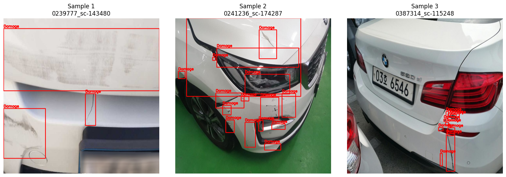
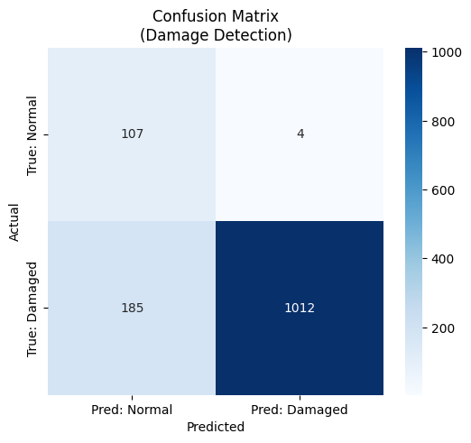
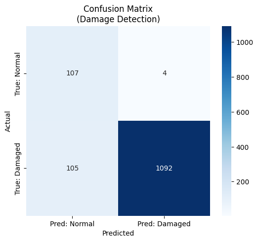
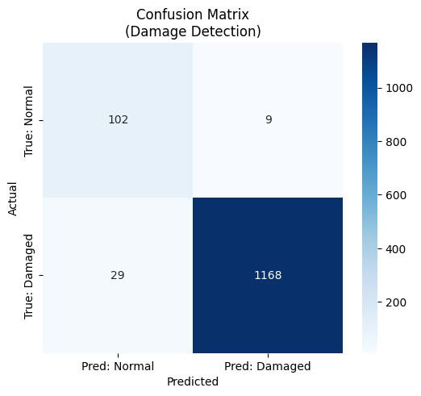

# 차량 파손 탐지(Car Damage Detection)
차량 이미지에서 파손 여부 및 파손 부위를 탐지하는 AI 모델 개발. 기존에 학습된 **차량 탐지 모델(Study 1)** 을 전처리기(Preprocessor)로 활용하여, 차량 영역을 크롭(Crop)한 뒤 파손을 탐지하는 2-Stage Pipeline을 구축

## Objective (실험 목표)
1. **Goal** : 차량 이미지에서 파손된 부위(Damage)를 정확하게 탐지하고, 정상 차량과 파손 차량을 분류.
2. **Model** : YOLOv8 (Ultralytics)
3. **Strategy** :
   - Stage 1 (Preprocessing): 1차 모델을 이용해 차량 위치(BBox) 식별 및 Crop
   - Stage 2 (Detection): Crop된 차량 이미지 내에서 파손 부위 탐지
4. **Data Strategy** :
   - Positive Sample (Damaged)과 Negative Sample (Normal)을 모두 활용하여 오탐(False Positive) 방지 학습
   - 파손 클래스 통합 (Scratched, Dented 등 -> Damage 단일 클래스)
     
## Experiment Setup (학습 환경)
* **Model:** YOLOv8 
* **Environment:** Google Colab Pro (L4 GPU)

## Workflow
1. 준비 (Preparation)
   - 입력 데이터:
      - Damaged: AI-Hub 자동차 파손 이미지 및 JSON 라벨 (12,000장)
      - Normal: 정상 차량 이미지 - coco2017(157) + kaggle dataset (920)
   - 도구 (Tool):
      - Study 1 모델: 이미 학습된 차량 탐지 모델 (yolov8x_fine_tuning_5th.pt)
2. Data Preparation
   1) 차량 탐지 (Detect Vehicle):
      - 1단계 모델을 사용하여 이미지에서 차량의위치BBox를 찾음
      - 만약 차량을 못 찾으면? → 원본 이미지 전체를 사용하도록 Fallback
   2) 영역 자르기 (Crop with Margin):
      - 차량 BBox에 여유공간(Margin15%) 을 더해서 이미지를 잘라냄.
      - 이미지 밖으로 나가는 좌표는 Clamp(울타리) 처리하여 이미지 안쪽으로 맞춤
   3) 라벨 변환 (Label Remapping):
      - Damaged: 원본 이미지 기준의 파손 좌표 (x, y)를 Crop된 이미지 기준의 상대 좌표로 변환
      - Normal: 파손이 없으므로 빈 텍스트 파일.txt을 생성 (Negative Sample 학습용)
      - 클래스 통합: 데이터 복잡도를 줄이기 위해 모든 파손 종류를 모두 'Damage' (ID: 0) 하나로 통합
3. 데이터 분할 (Splitting)
   - 전체 데이터를 Train (70%) : Val (20%) : Test (10%) 비율로 무작위 분할
   - 학습용, 검증용, 평가용 데이터를 미리 나누어 데이터 유출(Data Leakage)을 방지
4. 검증 (Verification)
   - 변환된 데이터(Test Set) 중 3장을 무작위로 뽑아, 파손 박스가 차량 위에 정확히 그려졌는지 눈으로 확인

| split | images | Damaged(box) | Normal(empty | 
| :---: | :---: | :---: |  :---: | 
| Train | 9153 | 8383 |770|
| Valid | 2616 | 2396 |220| 
| Test | 1308 | 1197 |111|  
| total | 13077 | 11967 |1101| 

| **dataset samples(검증)** | 
| :---: |
|  |

## 📊 Performance Evaluation (test set)

### 1. Metrics Comparison (파인튜닝 1st vs 파인튜닝 2nd * inference confidence threshold)

| Class | Model | Confidence score | Accuracy | average inference speed | FPS | GPU | test | fail |mAP50|mAP50-95|비고 |
| :---: | :---: |:---: | :---: | :---: | :---: |:---: | :---: |:---: |:---: |:---: |:---: |
| **Fine-tuned. ver1.0** | yolo v8m|0.25|85.55%| 11.71 ms/장 | 85.41 FPS |L4|1308 | 189 |0.286|0.133| IMG_SIZE 640 + BATCH_SIZE 32 + close_mosaic 10 |
| **Fine-tuned. ver1.0** | yolo v8m|0.10|97.02%| 11.71 ms/장 | 84.97 FPS |L4|1308 | 39 |0.286|0.133| IMG_SIZE 640 + BATCH_SIZE 32 + close_mosaic 10 |
| **Fine-tuned. ver2.0** | yolo v8x|0.25|91.67%| 18.48 ms/장 | 54.11 FPS |L4|1308 | 109 |0.303|0.142| IMG_SIZE 640 + BATCH_SIZE 16 + close_mosaic 10 |
| **Fine-tuned. ver2.0** | yolo v8x|0.10|97.09%| 18.64 ms/장 | 53.66 FPS |L4|1308 | 38 |0.303|0.142| IMG_SIZE 640 + BATCH_SIZE 16 + close_mosaic 10 |

### 💡 Findings
* fine-tuning과 inference confidence threshold 조정을 통해 Accuracy는 비약적으로 상승(85.55% > 97.9%)
* 동일하게 confidence 0.1 기준, yolo v8m과 v8x의 성능 차이는 거의 없음(속도는 v8m 우수)

| **Fine-tuned. ver1.0(0.25)** | **Fine-tuned. ver1.0(0.1)** | **Fine-tuned. ver2.0(0.25)** | **Fine-tuned. ver2.0(0.1)** |
| :---: | :---: | :---: | :---: |
|  |  |  |  |

| Model | Class | Precision | Recall | f1 | 
| :---: | :---: | :---: | :---: | :--- |  
| **Fine-tuned. ver1.0** |Non-Vehicle| 0.79 | 0.88 | 0.83 |  
| **Fine-tuned. ver1.0** |Vehicle| 0.99 | 0.98 | 0.98 | 
| **Fine-tuned. ver2.0** |Non-Vehicle| 0.78 | 0.92 | 0.84 |
| **Fine-tuned. ver2.0** |Vehicle| 0.99 | 0.98 | 0.98 | 

## 🛠 오탐 대상 
 - ver2.0의 confidence threhold 0.1 기준 총 6개의 오탐
 - damaged(2), normal(4)

| **false samples** | 
| :---: |
|  |

## 📝 Conclusion 
* **결론:** Fine-tuning을 통해 모델의 정확도를 비약적으로 상승시킴(97.09%)
