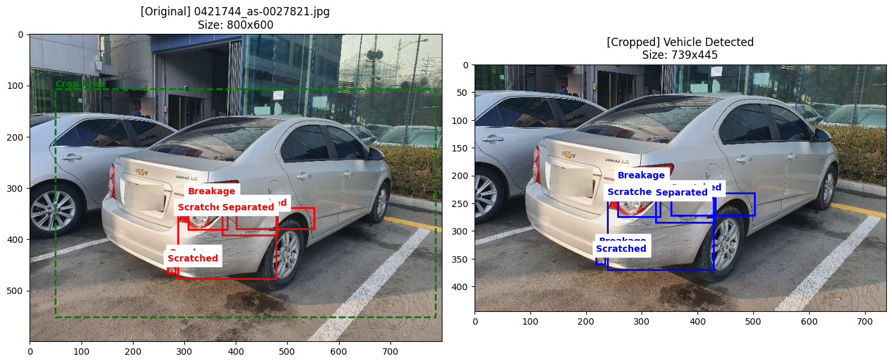

[](http://colab.research.google.com/github/thanxjiny/Vehicle-Damage-Detection/blob/main/notebooks/04_Damage_Detection_FineTuning_1st/1_study2_yolov8_class_all.ipynb)

# 차량 파손 유형 분류 (Damage Classification)
* 탐지된 차량의 파손 부위를 크롭(Crop)하여 파손의 종류를 정밀하게 분류하는 Stage2 분류 모델 구축
* 데이터 불균형 문제와 실제 활용을 감안하여 계층적 평가 지표(Major/Minor)를 도입

## 1. 데이터셋 구축 과정 (Data Preprocessing)
### 1) Stage 1(Car Detection) 결과를 활용하여 전처리
- Stage1 모델이 탐지한 차량의 Bounding Box 영역을 원본 이미지에서 crop하여 차량 외 불필요한 배경 제거
  - yolov8x_fine_tuning_5th, confidence threshold = 0.1 적용
  - 동일 이미지에 복수의 box 탐지 시, 가장 큰 box(차량) 선택
  - 만약 차량 이미지를 탐지하지 못 하면, 이미지 전체를 그대로 선택택
- 좌표 변환: 원본 이미지의 파손 위치 JSON 데이터를 크롭된 이미지의 상대 좌표로 재계산하여 정확한 학습 영역을 지정

| **dataset samples(원본 vs Crop 비교)** | 
| :---: |
|  |
  
### 2) 데이터 밸런싱 (Balancing)
* AI-HUB(50만장)에서 학습용(Train) 2,500장, 검증용(Val) 500장씩 클래스별로 균등하게 수집하여 특정 파손 유형에 모델이 편향되지 않도록 설계
 
| ID | Class | Images | 설명 |
| :--- | :--- | :--- |:--- |
| **0** | Scratched| 3,000 | 긁힘, 스크래치|
| **1** | Separated |  3,000 |이격, 벌어짐|
| **2** | Breakage |  3,000 |파손, 깨짐|
| **3** | Crushed  | 3,000 |찌그러짐|

```text
AI_HUB_DAMAGE_DATASET/
├── images/
│   ├── train/ (10,000장)
│   └── val/   (2,000장)
└── labels/
    ├── train/ (10,000개 .txt)
    └── val/   (2,000개 .txt)
```

### 3) DATA Split
- Damaged와 Nomal을 Train(70%) / Val(20%) / Test(10%) 무작위 분할을 통한 엄격한 검증
  - Damaged: 12,000 (파손 라벨 있음 / AI-HUB 라벨링 정보 활용)
  - Normal : 1,077 (파손 라벨 없음 / coco 2017 157장 + kaggle dataset 920장)
  - kaggle dataset : https://www.kaggle.com/datasets/anujms/car-damage-detection

| split | total | Damaged | Normal | 
| :---: | :---: | :---: |  :---: | 
| Train | 9153 | 8400 |753|
| Valid | 2616 | 2400 |216| 
| Test | 1308 | 1200 |108|  
| total | 13077 | 12000 |1077| 

```text
CAR_DAMAGE_DATASET_STAGE2_MULTI/  
├── images/  
│   ├── train/ (9153)  
│   └── val/   (2616)  
│   └── test/  (1308)  
└── labels/  
    ├── train/ (9153 txt 파일)  
    └── val/   (2616 txt 파일)  
    └── test/  (1308 txt 파일)
```  

| **dataset samples(crop images)** | 
| :---: |
|  |

## 2. 모델 학습 및 최적화
- Architecture: YOLOv8 Classification/Detection 기반 커스텀 모델
- Hyperparameter Tuning

| Hyperparameter| 구분 | 전략 |
| :--- | :--- | :--- |
| **yolov8x** | Model Selectio| n, s, m, l, x 중 가장 파라미터가 많고 성능이 뛰어난 x 모델을 선정(속도 보다는 정확도 우선) | 
| **patience=25** | Early Stopping| Epoch를 모두 채우지 않더라도, 25 Epoch 동안 성능(mAP) 향상이 없다면 학습을 조기 종료 | 
| **cos_lr=Tru** | Learning Rate Schedule | 학습 초기에는 높은 학습률(lr0=1e-4)로 빠르게 최적점에 접근하고, 학습 후반부로 갈수록 코사인 곡선을 그리며 학습률을 미세하게 줄임|
| **ingle_cls=False** | Multi-Class Detection |단순히 '파손 여부'만 판단하는 것이 아니라 파손 유형을 분|
| **close_mosaic=10** | Mosaic Augmentation Control  | 학습 초기에는 이미지 4장을 합치는 Mosaic 증강을 사용하여 작은 물체 탐지 능력을 키우고, 종료 10 Epoch 전부터는 이 기능을 끔|

### [참고] Mosaic Augmentation
 - 서로 다른 4장의 이미지를 랜덤하게 잘라서 1장의 이미지로 합치는 기술
 - [장점]
   - 이미지가 축소되어 합쳐지기 때문에, 모델은 평소보다 더 멀리 있는(작은) 물체를 찾는 법을 학습
   - 모델이 배경(Context)에 의존하지 않고, 객체 고유의 특징(Feature)에 집중
     - ex. 모자이크를 하면 범퍼 옆에 갑자기 '하늘'이나 '다른 차의 지붕'이 올 수 있음
   - 배치 사이즈 효율 (Batch Normalization)
     - 한 번에 1장을 보지만 실제로는 4장을 보는 효과
     - GPU 메모리 한계로 배치 사이즈(Batch=8, 16)가 작을 때, 학습 효과를 극대화
 - https://docs.ultralytics.com/guides/yolo-data-augmentation/#bgr-channel-swap-bgr

| **dataset samples(crop images)** | 
| :---: |
|  |

Separated |  3,000 |이격, 벌어짐|
| **2** | Breakage |  3,000 |파손, 깨짐|
| **3** | Crushed

## 3. 모델 평가 방법 (Evaluation Metrics)
- 한계. 기존 라벨링이 Scratched를 제외하고, 나머지 Separated, Breakage, Crushed 경계가 모호
- 활용 관점에서의 **계층적 평가(Hierarchical Evaluation)** 를 수행
 
### 1) 계층적 그룹화 (Major vs Minor): 파손의 심각도에 따라 두 그룹으로 나누어 성능을 별도 관리
 - Major Group (심각): Breakage, Crushed, Separated
   - claim : 수리가 시급하거나 부품 교체가 필요한 경우
   - UW : 파손이 심각하여 인수 거절 대상
 - Minor Group (경미): Scratched(외관상의 문제 위주)

### 2) 주요 지표
 - mAP50: 모든 클래스에 대한 평균 정밀도 평가
 - Confusion Matrix: 클래스 간 혼동 행렬 분석 (**Major 클래스를 Minor로 오판하는 Case 집중 분석**)
 - Group Accuracy: Major 그룹과 Minor 그룹 각각의 탐지 성공률 측정

## Performance Evaluation (test set)

### 1. Metrics Comparison (inference confidence threshold)

| conf | Model | Overall Accuracy | average inference speed | FPS | GPU |mAP50|mAP50-95|test|fail|
| :---: | :---: |:---: | :---: | :---: | :---: |:---: | :---: |:---: | :---: |
| **0.25** | yolo v8x|73.24%| 70.90 ms/장 | 14.10 FPS |T4|0.261|0.124|1308|337|
| **0.10** | yolo v8x|83.56%| 71.08 ms/장 | 14.07 FPS |T4|0.261|0.124|1308|215|

### 2. Result
* fine-tuning과 inference confidence threshold 조정을 통해 overall accuracy 상승(73.24% > 83.56%)

| **Fine-tuned. ver1.0(0.25)** | **Fine-tuned. ver1.0(0.1)** | 
| :---: | :---: | 
|  |  |

| actual |pred | target | miss | ratio |-|
| :---: | :---: | :---: | :---: | :--- |  
| major | minor or normal | 1002 | 102 | 0.101|major miss|
| minor | major | 1003 | 95 | 0.0947|minor miss|

## 오탐 대상 시각화 

| **critical miss** | 
| :---: |
|  |

| **minor miss** | 
| :---: |
|  |


