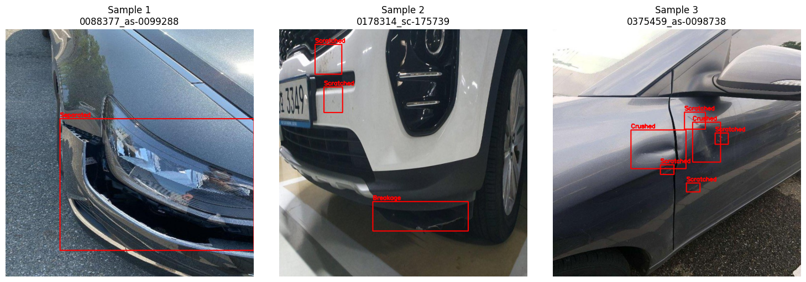
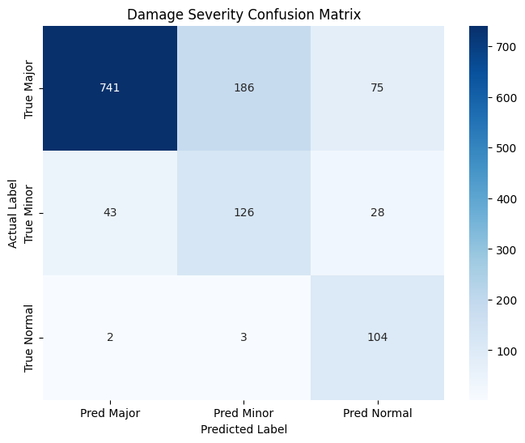
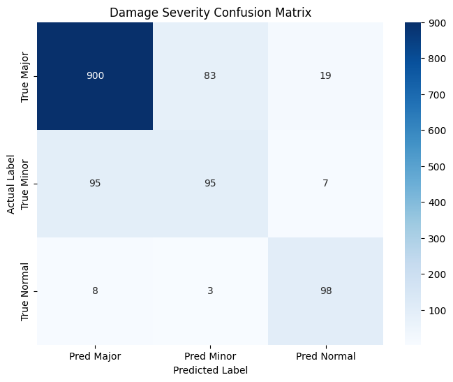

# 차량 파손 유형 분류 (Damage Categorization)
* 탐지된 차량의 파손 부위를 크롭(Crop)하여 파손의 종류를 정밀하게 분류하는 Stage 2 분류 모델 구축
* 데이터 불균형 문제와 실제 활용을 감안하여 계층적 평가 지표(Major/Minor)를 도입

## 데이터셋 구축 과정 (Data Preprocessing)
 - Stage1(Car Detection) 결과를 활용하여 전처
1.Stage 1 기반 Crop 데이터 생성
* 핵심 로직: Stage 1 모델이 탐지한 차량의 Bounding Box 영역을 원본 이미지에서 크롭하여 사용
  - yolov8x_fine_tuning_5th, confidence threshold = 0.1 적용
  - 동일 이미지에 복수의 box 탐지 시, 가장 큰 box(차량) 선택
  - 만약 차량 이미지를 탐지하지 못 하면, 이미지 전체를 그대로 선
* 좌표 변환: 원본 이미지의 파손 위치 JSON 데이터를 크롭된 이미지의 상대 좌표로 재계산하여 정확한 학습 영역을 지정
  
2. 클래스 매핑 및 통합
* 데이터의 특성에 맞춰 유사 클래스를 통합하고 ID를 부여합니다.
   - Class 0 (Scratched): 긁힘, 스크래치
   - Class 1 (Separated): 이격, 벌어짐
   - Class 2 (Breakage): 파손, 깨짐
   - Class 3 (Crushed): 찌그러짐 (Dent, Dented 포함)

3. 데이터 밸런싱 (Balancing)
* AI-HUB(50만장)에서 학습용(Train) 2,500장, 검증용(Val) 500장씩 클래스별로 균등하게 수집하여 특정 파손 유형에 모델이 편향되지 않도록 설계

4. DATA Split
* Damaged와 Nomal을 각각 train:val:test = 7:2:1로 분
- Damaged: 12000
- Normal : 1077
- CAR_DAMAGE_DATASET_STAGE2_MULTI

| split | total | Damaged | Normal | 
| :---: | :---: | :---: |  :---: | 
| Train | 9153 | 8400 |753|
| Valid | 2616 | 2400 |216| 
| Test | 1308 | 1200 |108|  
| total | 13077 | 12000 |1077| 

CAR_DAMAGE_DATASET_STAGE2_MULTI/  
├── images/  
│   ├── train/ (9153)  
│   └── val/   (2616)  
│   └── test/  (1308)  
└── labels/  
    ├── train/ (9153 txt 파일)  
    └── val/   (2616 txt 파일)  
    └── test/  (1308 txt 파일)  

| **dataset samples(crop images) ** | 
| :---: |
|  |

| **dataset samples(원본 vs Crop 비교)** | 
| :---: |
|  |

## 모델 학습 및 최적화
* Architecture: YOLOv8 Classification/Detection 기반 커스텀 모델
* Training Strategy:
   - Mixed Precision Training: 연산 속도 향상 및 메모리 효율화 적용
   - Auto-Clicker: Colab 환경에서의 세션 유지 스크립트 활용
   - Data Split: Train(70%) / Val(20%) / Test(10%) 무작위 분할을 통한 엄격한 검증

## 모델 평가 방법 (Evaluation Metrics)
* 실무적 관점에서의 **계층적 평가(Hierarchical Evaluation)** 를 수행

1) 계층적 그룹화 (Major vs Minor): 파손의 심각도에 따라 두 그룹으로 나누어 성능을 별도 관리
 - Major Group (심각): Breakage, Crushed, Separated (수리가 시급하거나 부품 교체가 필요한 경우)
 - Minor Group (경미): Scratched(외관상의 문제 위주)

2) 주요 지표
 - mAP50: 모든 클래스에 대한 평균 정밀도 평가
 - Confusion Matrix: 클래스 간 혼동 행렬 분석 (특히 Major 클래스를 Minor로 오판하는 Case 집중 분석)
 - Group Accuracy: Major 그룹과 Minor 그룹 각각의 탐지 성공률 측정

## 📊 Performance Evaluation (test set)

### 1. Metrics Comparison (파인튜닝 1st vs 파인튜닝 2nd * inference confidence threshold)

| Class | Model | Confidence score | Accuracy | average inference speed | FPS | GPU | test | fail |mAP50|mAP50-95|비고 |
| :---: | :---: |:---: | :---: | :---: | :---: |:---: | :---: |:---: |:---: |:---: |:---: |
| **Fine-tuned. ver1.0** | yolo v8m|0.25|85.29%| 11.06 ms/장 | 90.43 FPS |A100|136 | 20 |0.4011|0.2608| IMG_SIZE 640 + BATCH_SIZE 16 + close_mosaic 10 |
| **Fine-tuned. ver1.0** | yolo v8m|0.10|90.44%| 11.04 ms/장 | 90.55 FPS |A100|136 | 13 |0.4011|0.2608| IMG_SIZE 640 + BATCH_SIZE 16 + close_mosaic 10 |
| **Fine-tuned. ver2.0** | yolo v8x|0.25|92.65%| 21.81 ms/장 | 45.85 FPS |A100|136 | 10 |0.4404|0.3128| IMG_SIZE 1024 + BATCH_SIZE 16 + close_mosaic 15 |
| **Fine-tuned. ver2.0** | yolo v8x|0.10|95.59%| 22.27 ms/장 | 44.09 FPS |A100|136 | 6 |0.4404|0.3128| IMG_SIZE 1024 + BATCH_SIZE 16 + close_mosaic 15 |

### 💡 Findings
* fine-tuning과 inference confidence threshold 조정을 통해 Accuracy는 비약적으로 상승(85.29% > 95.59%)

| **Fine-tuned. ver1.0(0.25)** | **Fine-tuned. ver1.0(0.1)** | **Fine-tuned. ver2.0(0.25)** | **Fine-tuned. ver2.0(0.1)** |
| :---: | :---: | :---: | :---: |
|  |  |  |  |

| Model | Class | Precision | Recall | f1 | 
| :---: | :---: | :---: | :---: | :--- |  
| **Fine-tuned. ver1.0** |Non-Vehicle| 0.62 | 0.59 | 0.61 |  
| **Fine-tuned. ver1.0** |Vehicle| 0.94 | 0.95 | 0.95 | 
| **Fine-tuned. ver2.0** |Non-Vehicle| 0.87 | 0.76 | 0.81 |
| **Fine-tuned. ver2.0** |Vehicle| 0.97 | 0.98 | 0.97 | 

## 🛠 오탐 대상 
 - ver2.0의 confidence threhold 0.1 기준 총 6개의 오탐
 - damaged(2), normal(4)

| **false samples** | 
| :---: |
|  |

## 📝 Conclusion 
* **결론:** Fine-tuning을 통해 모델의 정확도를 비약적으로 상승시킴(95.59%)
