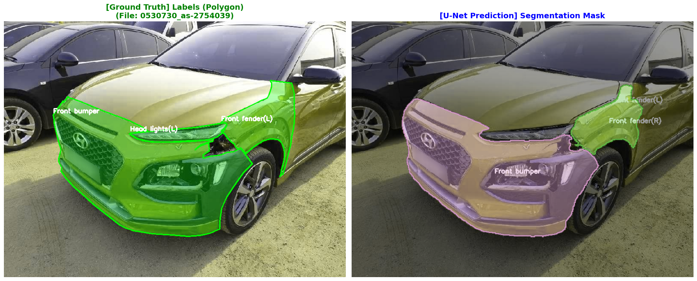

# 🚗 Car Damage Detection Model Comparison: YOLOv8-Seg vs U-Net
차량 파손 부위(범퍼, 휀다, 휠 등)를 정밀하게 탐지하기 위해 **Instance Segmentation (YOLOv8)**과 **Semantic Segmentation (U-Net)** 두 가지 모델을 학습하고 성능을 비교

## 📌 1. 프로젝트 개요 (Overview)

* **목표**: 차량 파손 이미지에서 손상 부위를 정확히 탐지하고, 수리비 견적 산출을 위한 기초 데이터(부위, 개수, 면적)를 확보함.
* **데이터셋**: Balanced Polygon Dataset (Train/Val/Test Split 완료)
* **사용 모델**:
    1.  **YOLOv8x-Seg**: 실시간 객체 탐지 및 분할에 특화된 모델 (Extra Large)
    2.  **U-Net (ResNet34)**: 의료 영상 등 정밀 분할에 주로 사용되는 전통적인 Segmentation 모델

| 비교 항목 | YOLO (Instance Seg) | U-Net (Semantic Seg) | 💡 차량 파손 탐지 적용 시 (분석) |
| :--- | :--- | :--- | :--- |
| **객체 분리** | **가능 (O)**   (개별 객체로 인식) | **불가능 (X)**   (하나의 덩어리로 인식) | **🏆 YOLO 승**   수리비 견적 산출 시 파손의 **'건수(Count)'** 파악이 핵심임 |
| **속도** | **매우 빠름**   (Real-time 가능) | **느림**   (무거운 구조) | **🏆 YOLO 승**   사용자가 사진을 촬영하고 **즉시 결과**를 확인해야 하는 UX에 적합 |
| **복합 손상** | **구분 가능**   (예: 찌그러짐 위에 긁힘) | **구분 불가**   (겹치면 하나의 '손상') | **🏆 YOLO 승**   여러 유형의 손상이 중첩된 경우 각각을 분리해내기에 유리함 |
| **데이터셋** | **Polygon 라벨링**   (점 찍기 방식) | **Mask 라벨링**   (픽셀 색칠 방식) | **🏆 YOLO 승**   Polygon 방식이 데이터 구축 속도가 빠르고 비용이 저렴함 |
| **경계면 정밀도** | **좋음**   (최신 버전에서 크게 향상) | **매우 좋음**   (픽셀 단위 완벽) | **✋ U-Net 우세**   0.1mm 오차 없는 초정밀 면적 계산이 필요한 연구용이라면 U-Net이 유리 |

---

## 📊 2. 모델 성능 비교 요약 (Performance Summary)

동일한 Test Dataset (1,800장)을 사용하여 두 모델의 **정확도(mIoU)**와 **속도(FPS)**를 측정

| 비교 항목 | **YOLOv8x-Seg** | **U-Net (ResNet34)** | **비고 (Winner)** |
| :--- | :--- | :--- | :--- |
| **정확도 (mIoU)** | **24.89%** | 10.35% | **🏆 YOLO (압도적 우위)** |
| **속도 (FPS)** | 16.67 FPS | **63.89 FPS** | 🚀 U-Net (빠름) |
| **주요 부품 인식** | 범퍼, 펜더 등 주요 부품 인식 우수 | 대부분의 클래스 인식 실패 | YOLO |
| **객체 분리** | **가능 (Instance Seg)** | 불가능 (Semantic Seg) | YOLO (견적 산출 유리) |

> **💡 핵심 결과**: U-Net이 속도는 빠르지만, mIoU 10% 수준으로 실제 사용이 불가능한 반면, **YOLO는 주요 부품에서 높은 정확도를 보여 실무 적용에 적합함.**

### 성능 비교 세부
1. YOLOv8-Seg 분석
* **장점**:
    * `Front Bumper (IoU 0.81)`, `Rear Bumper (IoU 0.74)` 등 면적이 크고 형태가 뚜렷한 부품에서 매우 높은 성능을 보임.
    * 손상 부위를 개별 객체로 인식하여 "스크래치 3건"과 같이 **건수 기반 견적 산출**이 가능함.
* **단점**:
    * `Wheel`, `Windshield`, `Pillar` 등 투명하거나 얇은 객체에 대한 인식률이 낮음 (데이터 보강 필요).
    * Extra Large 모델 사용으로 인해 FPS가 다소 낮으나(16 FPS), 이미지 기반 서비스에는 충분함.

2. U-Net 분석
* **한계점**:
    * **클래스 불균형(Class Imbalance)**: 배경(Background)이 대부분인 차량 이미지 특성상, 객체를 제대로 학습하지 못하고 배경으로 예측하는 경향이 강함.
    * **객체 분리 불가**: 인접한 손상 부위를 하나의 덩어리로 인식하여 개별 수리비 산출이 어려움.
    * 속도는 빠르지만 정확도가 너무 낮아 현업 적용이 어려움

### 성능 계산 코드
1. YOLO 코드 분석
   - 특징: 픽셀 누적(Pixel Accumulation)을 통한 전역(Global) 계산
   - 동작 방식:
      -   이미지를 한 장씩 불러옴
      - YOLO의 예측 결과(Polygon)와 정답(Polygon txt)을 모두 **바이너리 마스크(0과 1의 이미지)**로 변환
      - **total_intersection**과 **total_union**이라는 전역 변수에 모든 이미지의 교집합/합집합 픽셀 수를 누적
      - 모든 이미지를 다 돈 후에, Total Intersection / Total Union으로 최종 mIoU를 계산

   - 장점:
      - Standard Benchmark 방식: PASCAL VOC나 Cityscapes 챌린지 등에서 사용하는 가장 정확한(Global) mIoU 계산 방식입니다. 배치 크기와 상관없이 항상 동일한 결과가 나옴
    
2. U-Net 코드 분석
   - 특징: sklearn을 활용한 배치(Batch) 단위 평균 계산
   - 동작 방식:
      - DataLoader를 통해 이미지를 배치 단위(예: 8장씩)로 가져옴
      - 모델이 예측한 마스크(preds)와 정답 마스크(masks)를 1차원 배열(Flatten)로 펼침
      - jaccard_score(average='macro')를 사용해 해당 배치 내에서의 mIoU를 계산
      - 모든 배치의 mIoU 점수를 리스트(iou_scores)에 담은 뒤, 마지막에 **단순 평균(np.mean)**을 계슨

   - "Batch-wise Averaging": 전체 데이터셋의 픽셀을 한 번에 합쳐서 계산하는 것이 아니라, 배치별 점수의 평균을 계산. 따라서 배치 크기(Batch Size)에 따라 점수가 미세하게 달라질 수 있음
---

## 📈 3. 상세 분석 결과 (Detailed Analysis)

### 📈 YOLOv8-Seg 모델 성능 평가 및 데이터 분포
- **평가 데이터셋**: Test Set
- **전체 Box mAP(50-95)**: `0.3681`
- **전체 Mask mAP(50-95)**: `0.3546`

#### 📊 클래스별 상세 현황
| 순위 | 부위 명칭 (Class Name) | Train | Val | Test | Total | Test mAP |
| :---: | :--- | :---: | :---: | :---: | :---: | :---: |
| 7 | Front bumper | 3,380 | 741 | 707 | 4,828 | **0.9049** |
| 2 | Rear bumper | 2,105 | 482 | 477 | 3,064 | **0.8991** |
| 6 | Front fender(R) | 754 | 164 | 168 | 1,086 | **0.6617** |
| 1 | Front fender(L) | 675 | 129 | 175 | 979 | **0.6022** |
| 4 | Trunk lid | 530 | 120 | 109 | 759 | **0.5378** |
| 13 | Rear fender(R) | 500 | 106 | 114 | 720 | **0.5516** |
| 8 | Bonnet | 505 | 106 | 83 | 694 | **0.6580** |
| 14 | Rear fender(L) | 402 | 79 | 102 | 583 | **0.5483** |
| 12 | Head lights(R) | 376 | 74 | 62 | 512 | **0.2782** |
| 10 | Rear door(R) | 333 | 77 | 70 | 480 | **0.5752** |
| 21 | Head lights(L) | 329 | 77 | 68 | 474 | **0.3472** |
| 11 | Front door(R) | 269 | 64 | 53 | 386 | **0.4584** |
| 3 | Front Wheel(R) | 244 | 46 | 56 | 346 | **0.3777** |
| 15 | Rocker panel(R) | 236 | 46 | 43 | 325 | **0.2521** |
| 19 | Rear door(L) | 205 | 49 | 46 | 300 | **0.4160** |
| 17 | Side mirror(R) | 218 | 49 | 32 | 299 | **0.4755** |
| 23 | Front door(L) | 207 | 39 | 49 | 295 | **0.3868** |
| 20 | Side mirror(L) | 177 | 31 | 40 | 248 | **0.3487** |
| 16 | Rear lamp(L) | 153 | 25 | 37 | 215 | **0.2051** |
| 24 | Rear lamp(R) | 151 | 38 | 24 | 213 | **0.3780** |
| 22 | Front Wheel(L) | 144 | 29 | 32 | 205 | **0.1886** |
| 5 | Rocker panel(L) | 121 | 21 | 36 | 178 | **0.1592** |
| 9 | Rear Wheel(R) | 97 | 24 | 16 | 137 | **0.2370** |
| 18 | Rear Wheel(L) | 68 | 9 | 6 | 83 | **0.0343** |
| 28 | Rear windshield | 24 | 3 | 1 | 28 | **0.1567** |
| 25 | Windshield | 14 | 4 | 3 | 21 | **0.0000** |
| 31 | C pillar(R) | 4 | 5 | 1 | 10 | **0.0000** |
| 30 | A pillar(L) | 5 | 1 | 1 | 7 | **0.0000** |
| 32 | A pillar(R) | 2 | 1 | 4 | 7 | **0.0000** |
| 27 | Undercarriage | 3 | 1 | 2 | 6 | **0.0000** |
| 29 | C pillar(L) | 4 | 0 | 0 | 4 | **0.3546** |
| 26 | Roof | 2 | 0 | 0 | 2 | **0.3546** |

#### 데이터 수량 vs 성능 상관관계 분석

- Data Hunger Theory: 딥러닝 모델의 성능은 일반적으로 데이터 양의 로그(Log) 스케일에 비례하여 증가
    - 데이터가 10배 늘어날 때 성능이 선형적으로 증가
 - 이 패턴에서 벗어나는 클래스(데이터는 많은데 성능이 낮거나, 데이터는 적은데 성능이 높은 경우)는 **이상점(Outlier)**으로 간주하여 별도 분석이 필요
 - 단순히 "전체 mAP가 낮다"고 판단하는 오류를 범하지 않으려면, **"데이터가 부족해서 낮은 것인가, 형태가 어려워서 낮은 것인가?"**를 구분
 - 데이터 수량(Log Scale)과 성능(mAP) 간의 상관관계를 분석하고, 통계적으로 **이상점(Outlier)**을 식별하여 시각화
 - 표준편차 +- 1.5 이론적으로 전체의 약 13%(32개 중 약 4개)

| YOLOv8-Seg (performance_correlation_plot) | 
| :---: | 
| | 

- high efficiency(3) : Rear bumper, Roof, C pillar
- hard case(1) : Rear Wheel(L)
   - Wheel을 앞과 뒤, 좌와 우로 구분은 육안으로도 어려움   

## 🖼️ 4. 시각화 결과 (Visualization)

| YOLOv8-Seg | 
| :---: | 
| | 

| U-Net | 
| :---: | 
| | 

## 5. 향후 개선 가이드 (Next Steps)

### 🔧 YOLO 모델 성능(mIoU) 올리기
1. 0점 클래스 데이터 보강:
   - Rear Wheel(L), Windshield, Pillar 계열의 점수가 0. 이 부품들이 포함된 사진을 더 모으거나, 데이터 증강(Augmentation) 시 Crop이나 Rotation을 활용해 해당 부품이 잘리지 않게

2. 모델 경량화 (속도 개선이 필요하다면):
   - 만약 16 FPS가 너무 느리다면, yolov8m-seg (Medium) 또는 yolov8s-seg (Small)로 변경해보세요. mIoU는 1~3% 떨어지겠지만 속도는 2~3배 빨라짐

3. 이미지 해상도 조절:
   - 현재 imgsz=640을 사용 중인데, 작은 부품(Pillar 등)을 잘 잡으려면 1280으로 학습해보는 것도 방법

 
