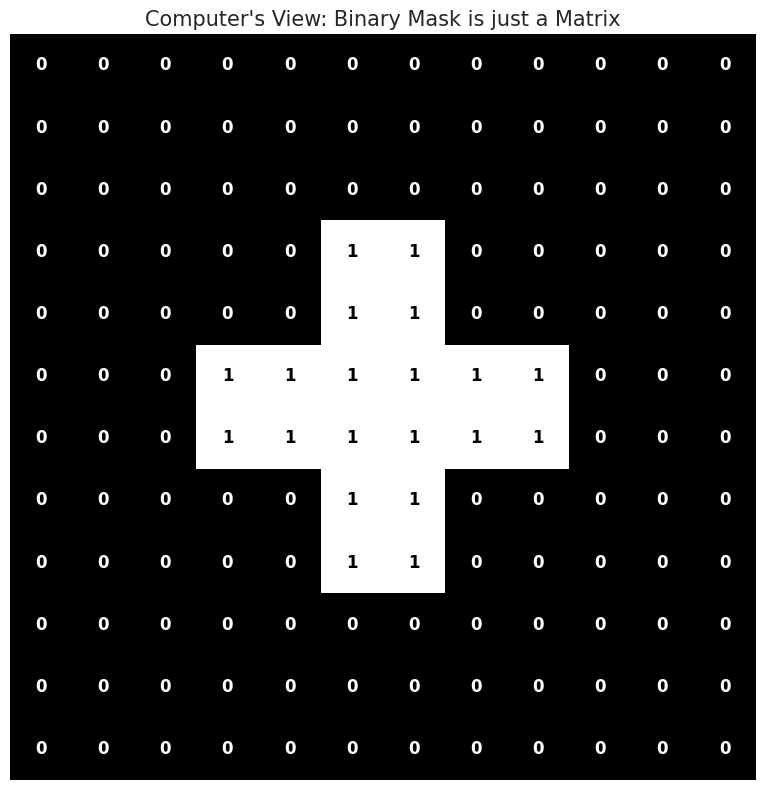
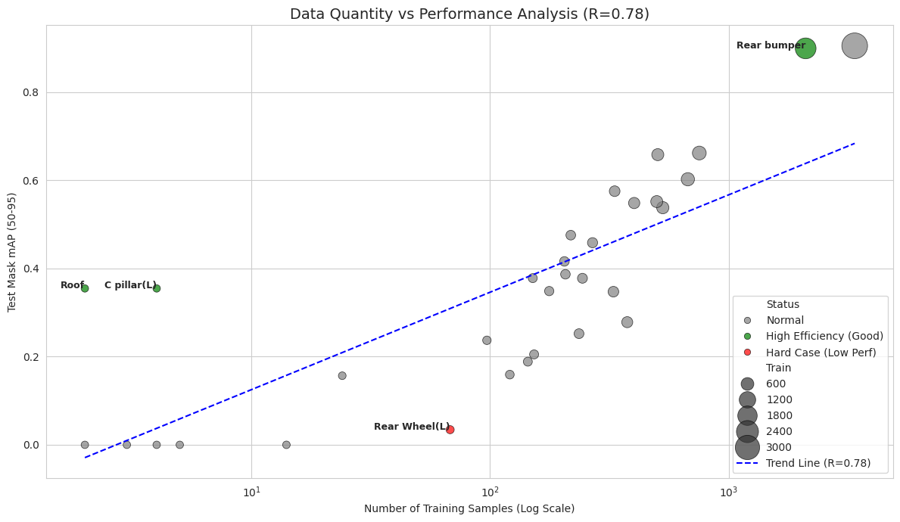
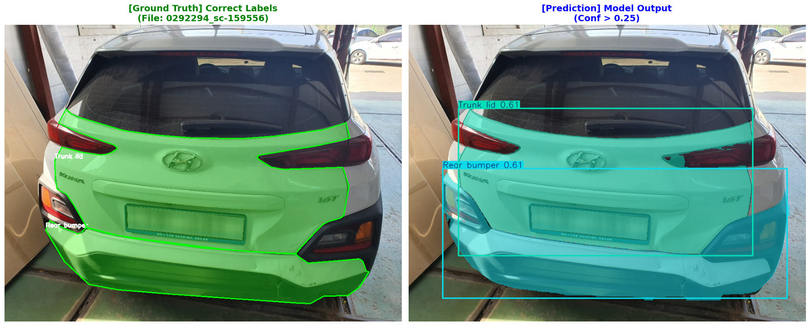
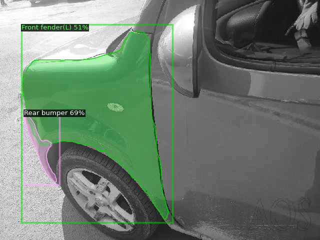

# 🚗 Car Damage Segmentation Model Comparison
## : YOLOv8 vs Mask R-CNN vs U-Net

본 프로젝트는 차량 파손 부위(범퍼, 휀다, 휠 등)를 정밀하게 탐지하고 견적을 산출하기 위해 **One-stage Instance Segmentation (YOLOv8)**, **Two-stage Instance Segmentation (Mask R-CNN)**, 그리고 **Semantic Segmentation (U-Net)** 세 가지 모델을 학습하고 성능을 비교 분석한 리포트입니다.

## 📌 1. 프로젝트 개요 (Overview)

* **목표**: 차량 파손 이미지에서 손상 부위를 정확히 탐지하고, 수리비 견적 산출을 위한 기초 데이터(부위, 개수, 면적)를 확보

* 데이터셋 경로(구글 드라이블 적용) : "/content/drive/MyDrive/03. HDMF/(share)HDMF_AUTO_SPOKE/DATA/04_DATA/balanced_dataset_split_polygon
    * 작업파일 : convert_dataset_polygon.py, sampling_dataset_polygon.py

```text
04_DATA/balanced_dataset_split_polygon/
├── images/
│   ├── train/ (8400 images)
│   └── val/   (1800 images)
│   └── test/  (1800 images) 
└── labels/
    ├── train/ (8400 txt 파일)
    └── val/   (1800 txt 파일)
    └── test/  (1800 txt 파일)
```

* **모델링**:
    * 적용 모델     
        1.  **YOLOv8x-Seg**: 속도와 정확도의 균형이 뛰어난 최신 One-stage 모델 (Extra Large)
        2.  **Mask R-CNN (ResNet50)**: 높은 정밀도를 자랑하는 전통적인 Two-stage 모델
        3.  **U-Net (ResNet34)**: 의료 영상 등 정밀 분할에 사용되는 Semantic Segmentation 모델
* 모델링 경로(구글 드라이블 적용) : "/content/drive/MyDrive/03. HDMF/(share)HDMF_AUTO_SPOKE/SUBJECT/WEEK4_CAR_DAMAGE_SEGMENTATION/DJ/

### 🔍 모델별 특성 비교 분석

| 비교 항목 | **YOLOv8 (1-Stage)** | **Mask R-CNN (2-Stage)** | **U-Net (Semantic)** | **💡 차량 파손 탐지 적용 시 (분석)** |
| :--- | :--- | :--- | :--- | :--- |
| **객체 분리** | **가능 (O)** | **가능 (O)** | **불가능 (X)** | **🏆 YOLO / Mask R-CNN** <br> '스크래치 3건' 처럼 개별 파손 건수 산출 필수 |
| **속도** | **빠름** <br> (Real-time) | **느림** <br> (Two-stage) | **매우 빠름** <br> (Backbone 의존) | **🏆 U-Net / YOLO** <br> 모바일 서비스 적용 시 FPS가 중요함 |
| **복합 손상** | **구분 가능** | **구분 가능** | **구분 불가** | **🏆 Instance Seg 승** <br> 겹쳐진 손상(동일 부위 복수 파손) 분리에 유리 |
| **정밀도(Mask)** | **우수** | **매우 우수** <br> (이론상) | **매우 우수** | **✋ Mask R-CNN 우세** <br> 경계면(Edge)을 가장 부드럽게 따냄 |

| binary mask matrix |
| :---: |
|  |
---

## 📊 2. 모델 성능 비교 요약 (Performance Summary)

동일한 Test Dataset (1,800장)을 사용하여 3가지 모델의 **탐지 정확도(Box mAP)**, **분할 정확도(Mask mAP/mIoU)**, **속도(FPS)** 를 측정

| Metric | **YOLOv8x-Seg** | **Mask R-CNN** | **U-Net** | **비고 (Winner)** |
| :--- | :---: | :---: | :---: | :--- |
| **Box mAP (@50-95)** | **36.8%** | 25.53% | N/A | **🏆 YOLO (압도적)** |
| **Mask mAP (@50-95)** | **34.9%** | 23.8% | N/A | **🏆 YOLO (압도적)** |
| **정확도 (mIoU)** | **24.89%** | 20.1% | 10.35% | **🏆 YOLO** |
| **속도 (FPS)** | 16.67 FPS | 6.34 FPS | **63.89 FPS** | 🚀 **U-Net** |
| **종합 평가** | **Selected (✅)** | Low Accuracy | Fast but Failed | **YOLO 선정** |

> **💡 핵심 결론**:
> 1.  **YOLOv8x-Seg**가 mAP와 mIoU 모든 정확도 지표에서 **1위를 기록**하며, Mask R-CNN 대비 약 2배 이상의 성능을 보임.
> 2.  **Mask R-CNN**은 이론상 정밀도가 높아야 하나, 본 데이터셋에서는 학습 부족 혹은 하이퍼파라미터 최적화 문제로 인해 성능이 저조함.
> 3.  **U-Net**은 가장 빠르지만, 객체(Instance)를 구분하지 못하고 정확도가 너무 낮아 현업 적용이 불가능함.

---

## 📈 3. 상세 분석 결과 (Detailed Analysis)

### 3-1. YOLOv8-Seg (최종 선정 모델)
* **성과**: `Front Bumper(mAP 0.90)`, `Rear Bumper(mAP 0.89)` 등 주요 부품에서 매우 높은 인식률을 기록
* **장점**:
    * **Robustness**: 크기가 큰 부품부터 작은 손상까지 균형 잡힌 검출 능력
    * **밸런스**: 16 FPS의 준수한 속도로 실시간성에 근접한 퍼포먼스 제공
* **단점**:
    * 투명 재질(`Windshield`, `Head lights`)이나 얇은 부품(`Pillar`) 인식률이 상대적으로 낮음

### 3-2. Mask R-CNN
* **성과**: Box mAP 15.4%, Mask mAP 16.5%로 기대보다 낮은 성능 기록
* **원인 분석**:
    * **데이터 특성**: YOLO의 강력한 Mosaic Augmentation 등이 적용되지 않아, 데이터가 부족한 클래스(Wheel, Pillar 등) 학습에 실패한 것으로 추정
    * **속도**: 7.99 FPS로 YOLO 대비 2배 느려, 실시간 서비스에는 부적합
* **가능성**: 추가적인 튜닝과 데이터 증강(Augmentation)을 적용한다면 정밀도(Mask Quality)는 개선될 여지가 있음.

### 3-3. U-Net
* **성과**: mIoU 10.35%로 사실상 탐지 실패
* **한계점**:
    * **Class Imbalance**: 배경이 90% 이상인 차량 이미지 특성상 배경 편향(Bias) 발생
    * **Instance 구분 불가**: 인접한 손상을 하나의 덩어리로 인식하여 '수리 견적'이라는 프로젝트 목적에 부합하지 않음

---

## 📊 4. 데이터 상관관계 및 분포 (Data Analysis)

### 📉 데이터 수량 vs 성능 상관관계 (Data Hunger Theory)
- 일반적으로 데이터 양(Log Scale)과 성능은 비례하나, 본 프로젝트에서는 일부 **이상점(Outlier)** 발견.
- **High Efficiency (적은 데이터, 고성능)**: `Rear Bumper`, `Roof` (형태가 단순하고 특징이 뚜렷함)
- **Hard Case (많은 데이터, 저성능)**: `Wheel` 계열 (앞/뒤, 좌/우 구분이 시각적으로 매우 어려움)

| Performance Correlation Plot |
| :---: |
|  |

#### 📊 클래스별 상세 현황
| No | 부위 명칭 (Class Name) | Train | Val | Test | Total | Test mAP |
| :---: | :--- | :---: | :---: | :---: | :---: | :---: |
| 1 | Front bumper | 3,380 | 741 | 707 | 4,828 | **0.9049** |
| 2 | Rear bumper | 2,105 | 482 | 477 | 3,064 | **0.8991** |
| 3 | Front fender(R) | 754 | 164 | 168 | 1,086 | **0.6617** |
| 4 | Front fender(L) | 675 | 129 | 175 | 979 | **0.6022** |
| 5 | Trunk lid | 530 | 120 | 109 | 759 | **0.5378** |
| 6 | Rear fender(R) | 500 | 106 | 114 | 720 | **0.5516** |
| 8 | Bonnet | 505 | 106 | 83 | 694 | **0.6580** |
| 9 | Rear fender(L) | 402 | 79 | 102 | 583 | **0.5483** |
| 10 | Head lights(R) | 376 | 74 | 62 | 512 | **0.2782** |
| 11 | Rear door(R) | 333 | 77 | 70 | 480 | **0.5752** |
| 12 | Head lights(L) | 329 | 77 | 68 | 474 | **0.3472** |
| 13 | Front door(R) | 269 | 64 | 53 | 386 | **0.4584** |
| 14 | Front Wheel(R) | 244 | 46 | 56 | 346 | **0.3777** |
| 15 | Rocker panel(R) | 236 | 46 | 43 | 325 | **0.2521** |
| 16 | Rear door(L) | 205 | 49 | 46 | 300 | **0.4160** |
| 17 | Side mirror(R) | 218 | 49 | 32 | 299 | **0.4755** |
| 18 | Front door(L) | 207 | 39 | 49 | 295 | **0.3868** |
| 19 | Side mirror(L) | 177 | 31 | 40 | 248 | **0.3487** |
| 20 | Rear lamp(L) | 153 | 25 | 37 | 215 | **0.2051** |
| 21 | Rear lamp(R) | 151 | 38 | 24 | 213 | **0.3780** |
| 22 | Front Wheel(L) | 144 | 29 | 32 | 205 | **0.1886** |
| 23 | Rocker panel(L) | 121 | 21 | 36 | 178 | **0.1592** |
| 24 | Rear Wheel(R) | 97 | 24 | 16 | 137 | **0.2370** |
| 25 | Rear Wheel(L) | 68 | 9 | 6 | 83 | **0.0343** |
| 26 | Rear windshield | 24 | 3 | 1 | 28 | **0.1567** |
| 27 | Windshield | 14 | 4 | 3 | 21 | **0.0000** |
| 28 | C pillar(R) | 4 | 5 | 1 | 10 | **0.0000** |
| 29 | A pillar(L) | 5 | 1 | 1 | 7 | **0.0000** |
| 30 | A pillar(R) | 2 | 1 | 4 | 7 | **0.0000** |
| 31 | Undercarriage | 3 | 1 | 2 | 6 | **0.0000** |
| 32 | C pillar(L) | 4 | 0 | 0 | 4 | **0.3546** |
| 33 | Roof | 2 | 0 | 0 | 2 | **0.3546** |

### ⚠️ 예측값 신뢰도 분포 (Confidence Distribution)
- **현상**: 낮은 신뢰도(0.0~0.1) 구간의 예측값이 전체의 **43.86%** 를 차지함.
- **해결책**: Inference 시 **Confidence Threshold를 0.25 이상**으로 설정하여 노이즈(False Positive)를 제거하면 정밀도가 대폭 향상됨

| 점수 구간 (Range) | 비율 (Ratio) | 분석 (Insight) |
| :---: | :---: | :--- |
| **0 ~ 9** | **43.86%** | ⚠️ **Noise (Low Confidence)** |
| 10 ~ 19 | 8.42% | ⚠️ Low Confidence |
| ... | ... | ... |
| **90 ~ 100** | **16.52%** | ✅ **High Confidence (확실한 탐지)** |

---

## 🖼️ 5. 시각화 결과 (Visualization)

| YOLOv8-Seg (Best Result) | Mask R-CNN | U-Net |
| :---: | :---: | :---: |
|  |   |  |
| **명확한 객체 분리 및 높은 정확도** | **탐지 누락 및 낮은 신뢰도** | **경계 불분명 및 뭉개짐 현상** |

---

## 🚀 6. 결론 및 향후 계획 (Conclusion)

### ✅ 최종 모델 선정: **YOLOv8x-Seg**
수리비 견적 시스템의 핵심인 **"개별 부품 식별(Instance Seg)"** 능력과 **주요 부품의 높은 정확도(mAP 0.90+)"** 를 근거로 최종 모델로 선정

### 🔧 향후 개선 과제 (To-Do)
1.  **Hard Example Mining**: 인식률이 0에 가까운 `Pillar`, `Windshield` 클래스에 대한 데이터 집중 수집 및 증강(Crop/Rotation)
2.  **Ensemble (앙상블)**: YOLO의 높은 Recall과 Mask R-CNN의 정밀한 Mask를 결합하는 앙상블 기법 연구
3.  **Post-processing**: 예측된 Mask의 경계면을 매끄럽게 다듬는 후처리 알고리즘 적용
