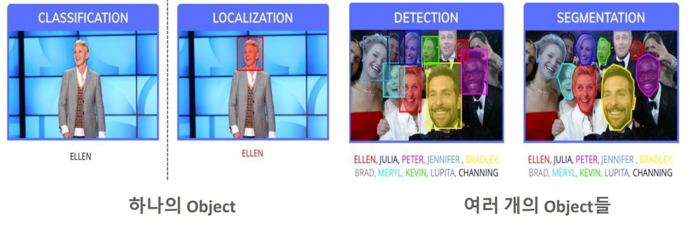
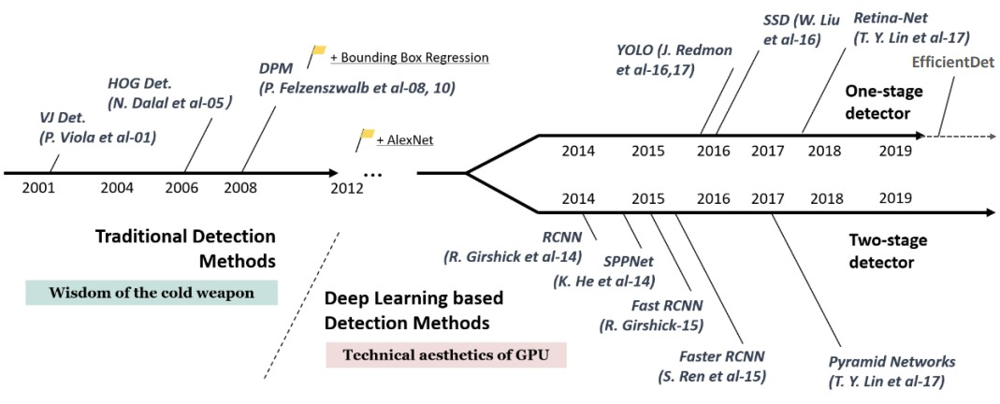
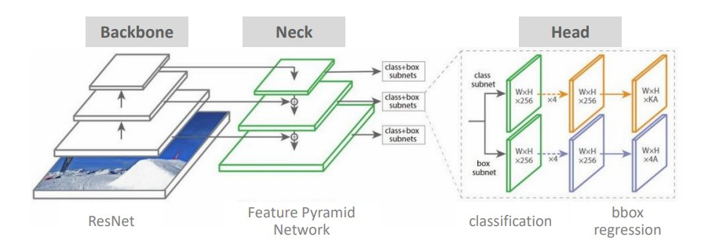

## 1. Object Detection 기초
### 🔹 Classification vs Object Detection
* **Classification:** "이 이미지가 무엇인가?" (Image Level)
* **Object Detection:** "무엇이 **어디에** 있는가?" (Instance Level)
    * **Localization:** 물체의 위치를 Bounding Box(x, y, w, h)로
    * **Classification:** 그 박스 안의 물체가 무엇인지 분류함.

#### localization/detection/segmentation
 

#### object detection history

#### object detection model

### 🔹 핵심 평가지표 (Metrics)
우리 프로젝트 성능 평가에 사용되는 지표입니다.
1.  **IoU (Intersection over Union):** 정답 박스와 예측 박스가 얼마나 겹치는가? (0~1 사이 값)
2.  **Precision & Recall:** 정밀도와 재현율.
3.  **mAP (mean Average Precision):** 모든 클래스에 대한 AP의 평균. (높을수록 좋음)

